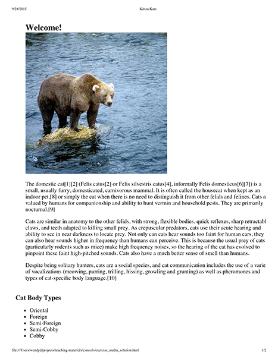

# Parte III

## Criando layouts para dispositivos móveis e para impressão

O objetivo deste exercício é usar media queries para fazer a página acima parecer diferente na hora da impressão e em diferentes tamanhos de tela.

**Realize as seguintes tarefas:**
1 - Adicione uma media query no arquivo CSS e as regras necessárias para que a página se pareça com a imagem abaixo quando ela for impressa. Especificamente:

- Os elementos com id header , navigation e footer devem desaparecer;
- O elemento com id aside deve ser mostrado abaixo do conteúdo principal.

2 - Adicione uma media query no arquivo CSS e as regras necessárias para que a página se pareça com as imagens abaixo quando a tela for redimensionada para larguras menores. Especificamente:

- O elemento com id aside deve desaparecer;
- O elemento body não deve ter padding ;
- As imagens não devem exceder a largura da tela;
- Os itens dentro do elemento navigation devem aparecer cada um em sua própria linha;
- O elemento com id header deve ser fixo, de forma que ele fique aparecendo sempre no topo da tela mesmo após o usuário rolar a página.

240x320: tela pequena

360x640 tela de smartphone
